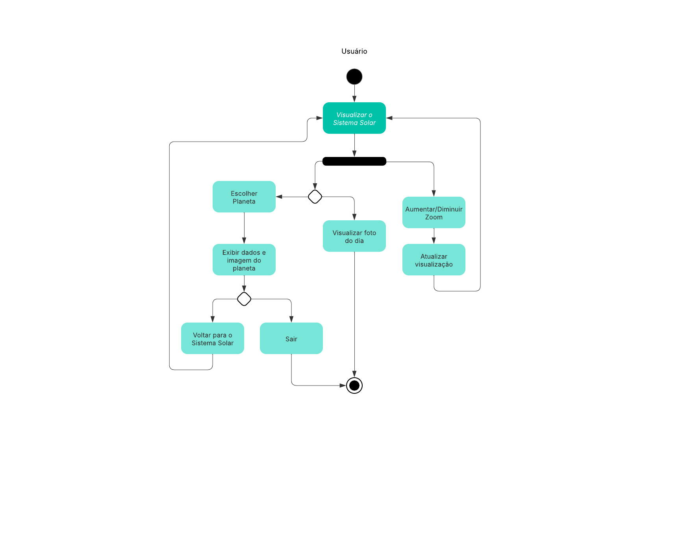

# 4.1 Documento de Arquitetura de Software (DAS)

## 4.1.1 Introdução

Este documento descreve a arquitetura do sistema **Planetário Virtual**, que visa proporcionar aos usuários uma experiência imersiva de observação de corpos celestes em um ambiente digital interativo. O documento detalha a representação arquitetural, os componentes principais, restrições e critérios de qualidade.

## 4.1.2 Representação Arquitetural

A arquitetura do sistema adota uma abordagem **cliente-servidor** com **frontend web interativo** e um **backend RESTful**. Os principais componentes são:

  - Aplicação Web (navegador) com visualização 3D
  - Servidor de aplicação (API REST)
  - Base de dados (JSON)

O estilo arquitetural predominante é **arquitetura em camadas**, separando apresentação, lógica de negócio e persistência de dados.

## 4.1.3 Metas e Restrições Arquiteturais

**Metas:**

  - Fornecer renderização 3D em tempo real de corpos celestes
  - Permitir consultas dinâmicas de dados astronômicos
  - Suportar acesso simultâneo de múltiplos usuários

**Restrições:**

  - Compatibilidade com navegadores modernos (Chrome, Firefox, Edge)
  - Uso de dados públicos de APIs externas (ex.: NASA)
  - Performance aceitável em hardware de especificação média

## 4.1.4 Visualização Caso de Uso

Os principais casos de uso incluem:

  - **Consultar corpo celeste:** Usuário seleciona um objeto e visualiza detalhes, como pode ser visto abaixo com mais detalhes: 

<details>
<summary><b>Visualizar Sistema Solar</b></summary>

<center>

| Campo                  | Descrição                                                                                                           |
| ---------------------- | ------------------------------------------------------------------------------------------------------------------- |
| **Nome**               | Visualizar Sistema Solar                                                                                            |
| **Ator Principal**     | Usuário                                                                                                             |
| **Atores Secundários** | Nenhum                                                                                                              |
| **Pré-condições**      | Nenhuma                                                                                                             |
| **Pós-condições**      | O sistema solar é exibido de forma interativa                                                                       |
| **Fluxo Principal**    | 1. O usuário acessa a visualização do sistema solar.<br>2. O sistema carrega e exibe a representação 2D do sistema. |
| **Fluxo Alternativo**  | -                                                                                                                   |
| **Regras de Negócio**  | - A visualização permite interação com planetas.                                                                    |


</center>
</details>


  - **Interagir no fórum:** Criar e responder postagens, mais detalhado abaixo:


<details>
<summary><b>Criar Postagem/Comentário</b></summary>

<center>

| Campo                  | Descrição                                                                                                                            |
| ---------------------- | ------------------------------------------------------------------------------------------------------------------------------------ |
| **Nome**               | Criar Postagem/Comentário                                                                                                            |
| **Ator Principal**     | Usuário                                                                                                                              |
| **Atores Secundários** | Nenhum                                                                                                                               |
| **Pré-condições**      | Usuário autenticado                                                                                                                  |
| **Pós-condições**      | Postagem ou comentário é exibido no fórum                                                                                            |
| **Fluxo Principal**    | 1. O usuário acessa o fórum.<br>2. O usuário preenche os dados da postagem ou comentário.<br>3. O sistema valida e salva o conteúdo. |
| **Fluxo Alternativo**  | 3a. Dados inválidos ou vazios:<br>  1. O sistema exibe erro e solicita correção.                                                     |
| **Regras de Negócio**  | - Conteúdo ofensivo pode ser filtrado automaticamente.                                                                               |


</center>
</details>

---


<font size="3"><p style="text-align: center"><b>Figura 1:</b> Representação UML do Padrão Factory Method (Clássico) </p></font>
<center>


</center>

<font size="3"><p style="text-align: center"><b>Autora</b>: [Milena Rocha](https://github.com/milenafrocha), 2025.</p></font>

## 4.1.5 Visualização Lógica

A visualização lógica organiza os componentes em camadas:

  * **Camada de Apresentação**

      * Interface Web (HTML, CSS, JavaScript, Next)

  * **Camada de Lógica**

      * API REST (FastAPI)

  * **Camada de Persistência**

      * Banco de dados (JSON)
      * Cache local para otimizar consultas

## 4.1.6 Visualização de Processo

Os processos são distribuídos em:

  * **Processo do Cliente:** Renderização gráfica e interação do usuário.
  * **Processo do Servidor:** Exposição de API REST, autenticação e agregação de dados.
  * **Processo de Sincronização de Dados:** Job que periodicamente atualiza o banco com dados astronômicos de APIs externas.

## 4.1.7 Visualização de Deploy

A infraestrutura é implantada em nuvem:

  * **Frontend:** Render
  * **Backend e Banco de Dados:** Render


<font size="3"><p style="text-align: center"><b>Figura 2:</b> Arquitetura em Camadas </p></font>
<center>


</center>

<font size="3"><p style="text-align: center"><b>Autora</b>: [Milena Rocha](https://github.com/milenafrocha), 2025.</p></font>


## 4.1.8 Visualização de Implementação

O repositório é organizado da seguinte forma:

```
── projeto
    ├── grupo1
    │   ├── README.md
    │   ├── backend
    │   │   ├── .gitkeep
    │   │   ├── README.md
    │   │   ├── api.md
    │   │   ├── app
    │   │   │   ├── __init__.py
    │   │   │   ├── data_classes
    │   │   │   │   ├── comentario_data.py
    │   │   │   │   ├── postagem_data.py
    │   │   │   │   └── user_data.py
    │   │   │   ├── decorators
    │   │   │   │   └── auth_decorator.py
    │   │   │   ├── main.py
    │   │   │   ├── models
    │   │   │   │   ├── comentario_model.py
    │   │   │   │   ├── postagem_model.py
    │   │   │   │   └── user_model.py
    │   │   │   ├── routers
    │   │   │   │   ├── comentario_router.py
    │   │   │   │   ├── postagem_router.py
    │   │   │   │   └── user_router.py
    │   │   │   ├── services
    │   │   │   │   ├── comentario_service.py
    │   │   │   │   ├── forum_service.py
    │   │   │   │   └── postagem_service.py
    │   │   │   └── utils.py
    │   │   ├── backup-db.json
    │   │   ├── db.json
    │   │   └── requirements.txt
    │   └── frontend
    │       ├── .gitignore
    │       ├── README.md
    │       ├── eslint.config.mjs
    │       ├── next.config.ts
    │       ├── package-lock.json
    │       ├── package.json
    │       ├── postcss.config.mjs
    │       ├── public
    │       │   ├── file.svg
    │       │   ├── globe.svg
    │       │   ├── logo.svg
    │       │   ├── next.svg
    │       │   ├── vercel.svg
    │       │   └── window.svg
    │       ├── src
    │       │   ├── app
    │       │   │   ├── (auth)
    │       │   │   │   └── login
    │       │   │   │       └── page.tsx
    │       │   │   ├── (main)
    │       │   │   │   ├── layout.tsx
    │       │   │   │   ├── meu-perfil
    │       │   │   │   │   └── page.tsx
    │       │   │   │   ├── page.tsx
    │       │   │   │   ├── postagens
    │       │   │   │   │   └── [id]
    │       │   │   │   │       └── page.tsx
    │       │   │   │   └── usuarios
    │       │   │   │       └── page.tsx
    │       │   │   ├── favicon.ico
    │       │   │   ├── globals.css
    │       │   │   ├── layout.tsx
    │       │   │   └── lib
    │       │   │       └── sortingStrategies.ts
    │       │   ├── components
    │       │   │   ├── auth
    │       │   │   │   └── LoginControls.tsx
    │       │   │   ├── forum
    │       │   │   │   ├── CommentForm.tsx
    │       │   │   │   ├── CreatePostForm.tsx
    │       │   │   │   ├── PostDetailView.tsx
    │       │   │   │   ├── PostItem.tsx
    │       │   │   │   └── PostList.tsx
    │       │   │   ├── layout
    │       │   │   │   ├── Footer.tsx
    │       │   │   │   └── Navbar.tsx
    │       │   │   ├── providers
    │       │   │   │   └── ToastProvider.tsx
    │       │   │   └── users
    │       │   │       └── UserCard.tsx
    │       │   ├── contexts
    │       │   │   └── AuthContext.tsx
    │       │   └── services
    │       │       ├── api.ts
    │       │       └── apiAdapters.ts
    │       └── tsconfig.json
```

Cada módulo é versionado independentemente.

## 4.1.9 Visualização de Dados

O modelo de dados principal inclui:

<font size="3"><p style="text-align: center"><b>Figura 3:</b> DER </p></font>
<center>


</center>

<font size="3"><p style="text-align: center"><b>Autora</b>: [Milena Rocha](https://github.com/milenafrocha), 2025.</p></font>

### MER – Modelo Entidade Relacionamento

Entidades e Relacionamentos

#### **USUÁRIO**

  * **Atributos:**

      * `id_usuario` (PK)
      * `nome`
      * `tipo`

  * **Relacionamentos:**

      * *Escreve* POSTAGEM (1:N)
      * *Comenta* COMENTARIO (1:N)

-----

#### **POSTAGEM**

  * **Atributos:**

      * `id_postagem` (PK)
      * `conteudo`
      * `data_criacao`
      * `autor_id` (FK)

  * **Relacionamentos:**

      * *Recebe* COMENTARIO (1:N)

-----

#### **COMENTARIO**

  * **Atributos:**

      * `id_comentario` (PK)
      * `conteudo`
      * `data_criacao`
      * `autor_id` (FK)
      * `postagem_id` (FK)

-----

### DLD – Dicionário de Dados

#### Tabela: USUARIO

| Campo       | Tipo | Chave | Obrigatório | Descrição                      |
| ----------- | ---- | ----- | ----------- | ------------------------------ |
| id\_usuario | int  | PK    | Sim         | Identificador único do usuário |
| nome        | text |       | Sim         | Nome do usuário                |
| tipo        | text |       | Sim         | Tipo de usuário (ex.: comum)   |

-----

#### Tabela: POSTAGEM

| Campo         | Tipo     | Chave | Obrigatório | Descrição                          |
| ------------- | -------- | ----- | ----------- | ---------------------------------- |
| id\_postagem  | int      | PK    | Sim         | Identificador único da postagem    |
| conteudo      | text     |       | Sim         | Conteúdo textual da postagem       |
| data\_criacao | datetime |       | Sim         | Data e hora de criação da postagem |
| autor\_id     | int      | FK    | Sim         | Referência ao usuário autor        |

-----

#### Tabela: COMENTARIO

| Campo          | Tipo     | Chave | Obrigatório | Descrição                             |
| -------------- | -------- | ----- | ----------- | ------------------------------------ |
| id\_comentario | int      | PK    | Sim         | Identificador único do comentário    |
| conteudo       | text     |       | Sim         | Conteúdo textual do comentário       |
| data\_criacao  | datetime |       | Sim         | Data e hora de criação do comentário |
| autor\_id      | int      | FK    | Sim         | Referência ao usuário autor          |
| postagem\_id   | int      | FK    | Sim         | Referência à postagem comentada      |

-----

#### Resumo dos Relacionamentos

  * **USUARIO – POSTAGEM**
    1:N (Um usuário pode escrever muitas postagens)

  * **USUARIO – COMENTARIO**
    1:N (Um usuário pode escrever muitos comentários)

  * **POSTAGEM – COMENTARIO**
    1:N (Uma postagem pode receber muitos comentários)

## 4.1.10 Qualidade

Critérios de qualidade incluem:

  * **Usabilidade:** Interface intuitiva e responsiva
  * **Segurança:** HTTPS, autenticação JWT, validação de input
  * **Escalabilidade:** Capacidade de atender crescimento de usuários e dados

## 4.1.11 Diagrama de Atividades

O **Diagrama de Atividade** é um tipo de diagrama comportamental que representa graficamente o fluxo de controle de uma atividade para outra, se assemelha a um fluxograma, permite modelar comportamento baseado em fluxo.

Seguindo a ideia dos casos de usos, onde os principais escolhidos foram consultar corpo celeste e interagir no fórum, segue abaixo o diagrama de atividades destes:

### Visualização do Sistema Solar:

**Figura 4:** Diagrama de Atividade da visualização do Sistema Solar do Site<a id="figura"></a>



**Autores:** [Antônio Júnior](https://github.com/antonioleaojr), [Carlos Eduardo](https://github.com/dudupaz), [Letícia Torres](https://github.com/leticiatmartins), [João Lucas](https://github.com/jlucasiqueira) e [Taynara Vitorino](https://github.com/taybalau), 2025.
</center>

### Uso do Fórum:

**Figura 2:** Diagrama de Atividade de Uso do Fórum<a id="figura"></a>


**Autores:** [Antônio Júnior](https://github.com/antonioleaojr), [Carlos Eduardo](https://github.com/dudupaz), [Letícia Torres](https://github.com/leticiatmartins), [João Lucas](https://github.com/jlucasiqueira) e [Taynara Vitorino](https://github.com/taybalau), 2025.
</center>


## Referências Bibliográficas

>1. <a id="ref1"></a> FOWLER, Martin. **UML Essencial**. 3. ed. Rio de Janeiro: Alta Books, 2010.  
>
>2. 
>
>3. 
>
>4. 

## Histórico de Versões

| Versão | Data       | Descrição                                      | Autor               | Revisor            |
|--------|------------|------------------------------------------------|---------------------|--------------------|
| 1.0    | 03/07/2025 | Criação do documento, adição da visualização dos casos de uso, visualização do deploy, implementação, dados. | [Milena Rocha](https://github.com/milenafrocha) | [Antônio Júnior](https://github.com/antonioleaojr) |
| 1.1    | 03/07/2025 | Adição de detalhes ao caso de uso, implementação do histórico de versões e referências. |[Antônio Júnior](https://github.com/antonioleaojr) | [Milena Rocha](https://github.com/milenafrocha) |   
| 1.2    | 03/07/2025 | Adição diagrama de atividades e assets. |[Antônio Júnior](https://github.com/antonioleaojr) | [Taynara Vitorino](https://github.com/taybalau) |                                                                                                                       
