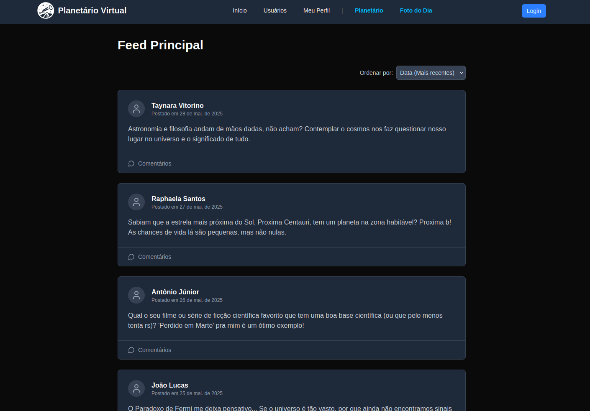
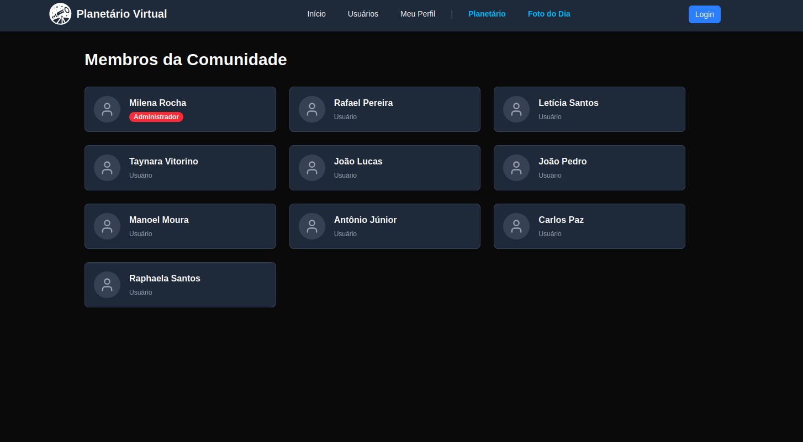

# Aplicação Interna - Reutilização por Componentização

Este documento detalha a estratégia de reutilização de caixa-branca do projeto, focada na criação de nossos próprios ativos reutilizáveis. A principal manifestação dessa estratégia é a criação de um conjunto de funções e componentes que encapsulam lógicas complexas, permitindo sua reutilização em diferentes partes do sistema, como no Planetário, na funcionalidade de Imagem do Dia e no Fórum.

> Acesse o projeto completo: [Planetário Virtual](https://2025-1-t02-g7-planetario-virtual-en-seven.vercel.app/home/index.html)

## 1. A Estratégia: Construindo uma Biblioteca de Funções e Componentes Interna

A estratégia da equipe para a reutilização interna foi focada na criação de funções e componentes de alta coesão e baixo acoplamento, que servem como "blocos de construção" para as funcionalidades do sistema. Em vez de duplicar código para tarefas recorrentes, como a criação de elementos visuais, comunicação com APIs ou renderização de listas, desenvolvemos um conjunto de ativos parametrizáveis.

A abordagem seguiu os seguintes princípios:

- Separação de Lógica e Apresentação: Funções e componentes encapsulam a lógica de negócio ou de renderização, enquanto a configuração e os dados são passados via props.

- Responsabilidade Única: Cada ativo foi projetado para ter uma responsabilidade clara e bem definida, facilitando seu entendimento, teste e manutenção.

- Composição: Componentes mais complexos são construídos a partir da composição de componentes mais simples, como visto no PostList que utiliza múltiplos PostItem.

- Parametrização: Os ativos são projetados para serem genéricos, aceitando parâmetros (props) que permitem adaptar seu comportamento a diferentes contextos sem a necessidade de alterar seu código-fonte.

## 2. Estudos de Caso

Esta seção apresenta exemplos concretos de reutilização interna, divididos pelas principais funcionalidades do projeto.

## **Parte 1: Planetário e Imagem do Dia**

> Link da pasta com todos os códigos do Planetário e Imagem do Dia: [Planetário + Imagem do Dia](https://github.com/UnBArqDsw2025-1-Turma02/2025.1-T02-_G7_PlanetarioVirtual_Entrega_03/tree/main/projeto/grupo2)

### 2.1. Estudo de Caso: Função `criarAstro`

> Link para o código: [Código](https://github.com/UnBArqDsw2025-1-Turma02/2025.1-T02-_G7_PlanetarioVirtual_Entrega_03/blob/main/projeto/grupo2/home/index.html)

#### O Problema:
A necessidade de renderizar múltiplos corpos celestes (planetas, luas) de forma programática, cada um com características únicas (tamanho, cor, órbita, textura) sem duplicar a complexa lógica de criação e animação para cada astro.

#### A Solução (O Código do Ativo):
Foi criada uma função genérica que centraliza a lógica de criação de um astro, recebendo todas as suas propriedades como parâmetros.

``` javascript
/**
 * Função genérica para criar astros no sistema solar.
 * @param {Phaser.Scene} scene - A cena onde o astro será criado.
 * @param {number} x - Posição inicial X.
 * @param {number} y - Posição inicial Y.
 * @param {number} tamanho - Raio do astro.
 * @param {number} corHex - Cor do astro em hexadecimal.
 * @param {object} orbita - Configuração da órbita { centro, raio, velocidade }.
 * @param {number} zoom - Nível de zoom ao clicar.
 * @param {string} textura - Chave da imagem de textura.
 * @returns {Phaser.GameObjects.Sprite} O objeto do astro criado.
 */
function criarAstro(scene, x, y, tamanho, corHex, orbita, zoom, textura) {
    // ... lógica de criação do sprite, física e animação da órbita ...
}
``` 
#### A Aplicação (Reutilização no Projeto):
A mesma função é chamada múltiplas vezes para popular o sistema solar, criando tanto planetas orbitando o sol quanto luas orbitando planetas.

``` javascript
// Criando a Terra orbitando o Sol
const terra = criarAstro(this, 0, 0, 10, 0x0000ff, { centro: sol, raio: 200, velocidade: astroVel }, 30, 'terra');

// Criando a Lua orbitando a Terra
const lua = criarAstro(this, 0, 0, 2, 0xffffff, { centro: terra, raio: 20, velocidade: 0.01 }, 90, 'lua');
```

### 2.2. Estudo de Caso: Função `criarCinturao`

> Link para o código: [Código](https://github.com/UnBArqDsw2025-1-Turma02/2025.1-T02-_G7_PlanetarioVirtual_Entrega_03/blob/main/projeto/grupo2/home/index.html)

#### O Problema:
A necessidade de criar cinturões de asteroides com centenas ou milhares de objetos, o que seria impraticável e ineficiente de se fazer manualmente.

#### A Solução (O Código do Ativo):
Uma função reutilizável foi desenvolvida para gerar um número configurável de asteroides dentro de um raio definido, distribuindo-os de forma procedural.

``` javascript
/**
 * Função para criar um cinturão de asteroides.
 * @param {Phaser.Scene} scene - A cena.
 * @param {number} x - Posição X do centro.
 * @param {number} y - Posição Y do centro.
 * @param {number} raioInterno - Raio interno do cinturão.
 * @param {number} raioExterno - Raio externo do cinturão.
 * @param {number} quantidade - Número de asteroides.
 */
function criarCinturao(scene, x, y, raioInterno, raioExterno, quantidade) {
    // ... lógica para gerar múltiplos asteroides em posições aleatórias dentro dos raios ...
}
```
#### A Aplicação (Reutilização no Projeto):
A função é usada para criar tanto o cinturão de asteroides principal quanto o cinturão de Kuiper.

``` javascript
const asteroides = criarCinturao(this, 0, 0, 280, 320, 200);
const kuiper = criarCinturao(this, 0, 0, 700, 800, 600);
```

### 2.3. Estudo de Caso: Funções de Comunicação com API (APOD)

> Link para o código: [Código](https://github.com/UnBArqDsw2025-1-Turma02/2025.1-T02-_G7_PlanetarioVirtual_Entrega_03/tree/main/projeto/grupo2/fotos)

#### O Problema:
A necessidade de desacoplar a lógica de comunicação com a API APOD da NASA da lógica de apresentação dos dados na interface. Era preciso também adaptar a resposta da API para um formato mais conveniente para a aplicação.

#### A Solução (O Código do Ativo):
Foram criadas múltiplas funções com responsabilidades únicas: uma para buscar os dados (photoProvider), uma para adaptar o formato (nasaApodAdapter), e outra para orquestrar a busca e exibição (fetchAndDisplayNasaPhotos).

``` javascript
// Adapta os dados da API para o formato esperado pela aplicação
function nasaApodAdapter(data) {
    // ... lógica de transformação dos dados ...
    return adaptedData;
}

// Abstrai a lógica de busca de fotos, permitindo trocar a fonte de dados no futuro
const photoProvider = {
    getPhotos: async (startDate, endDate) => {
        // ... lógica de chamada à API usando fetch ...
    }
};
```

#### A Aplicação (Reutilização no Projeto):
Essas funções são combinadas para criar a funcionalidade completa da "Imagem do Dia", podendo ser reutilizadas ou estendidas facilmente.

``` javascript
async function fetchAndDisplayNasaPhotos(provider, startDate, endDate) {
    const photos = await provider.getPhotos(startDate, endDate);
    const adaptedPhotos = photos.map(nasaApodAdapter);
    // ... lógica para exibir as fotos adaptadas na UI ...
}

// Chamada da função principal
fetchAndDisplayNasaPhotos(photoProvider, '2025-06-01', '2025-06-10');
```

## **Parte 2: Fórum - Frontend**

> Link da pasta com todos os códigos do Fórum: [Fórum](https://github.com/UnBArqDsw2025-1-Turma02/2025.1-T02-_G7_PlanetarioVirtual_Entrega_03/tree/main/projeto/grupo1/frontend)

No frontend, o Next.js foi utilizado como Framework. O Next.js, que é uma implementação React segue os mesmos princípios: componentização. Os componentes da tela são desenvolvidos uma única vez, de forma que possam ser reutilizados inúmeras vezes dentro do mesmo projeto, ou até mesmo em outros projetos, criando-se um pacote instalável pelo node. Nesse sentido, o frontend do fórum do planetário virtual possui inúmeros compoenentes, que podem ser vistos no link acima. Abaixo, serão apresentados apenas alguns deles, para evitar repetições exaustivas da explicação do mesmo princípio.

### 2.4. Estudo de Caso: Componente `PostItem`

> Link para o código: [Código](https://github.com/UnBArqDsw2025-1-Turma02/2025.1-T02-_G7_PlanetarioVirtual_Entrega_03/blob/main/projeto/grupo1/frontend/src/components/forum/PostItem.tsx)


#### O Problema:
A necessidade de exibir postagens de forma padronizada em todo o fórum, garantindo que o layout, as informações do autor e as ações (como excluir) fossem consistentes, evitando a duplicação de código HTML e CSS.

#### A Solução (O Código do Ativo):
Foi criado um componente PostItem que recebe um objeto post como prop e é totalmente responsável por sua própria renderização. Ele encapsula a lógica de formatação de data e a verificação de permissões para exibir o botão de exclusão.

``` javascript
// src/components/forum/PostItem.tsx
import type { Post } from '@/services/api';
import Link from 'next/link';
import { MessageCircle, Trash2, User as UserIcon } from 'lucide-react';
import { useAuth } from '@/contexts/AuthContext';

type PostItemProps = {
    post: Post;
    onDelete: (postId: number) => void;
};

export function PostItem({ post, onDelete }: PostItemProps) {
    const { user } = useAuth();
    const canDelete = user && (user.tipo === 'moderador' || user.id === post.autor.id);

    const handleDeleteClick = (e: React.MouseEvent) => {
    e.preventDefault();
    e.stopPropagation();
    // Em um ambiente real, usaríamos um modal de confirmação em vez de `confirm()`.
    if (confirm('Tem certeza que deseja excluir esta postagem?')) {
        onDelete(post.id);
    }
    };

    return (
    <div className="bg-gray-800 border border-gray-700 rounded-lg mb-6">
        {/* ... Lógica de renderização do post, autor, texto e botão de exclusão ... */}
        <p className="font-semibold text-white">{post.autor.nome}</p>
        <p className="text-gray-300">{post.texto}</p>
        {/* ... Link para comentários ... */}
    </div>
    );
}
``` 

#### A Aplicação (Reutilização no Projeto):
Este componente é reutilizado dentro do `PostList`, que o renderiza para cada item em um array de postagens, como será visto no próximo estudo de caso.

### 2.5. Estudo de Caso: Componente `PostList`

> Link para o código: [Código](https://github.com/UnBArqDsw2025-1-Turma02/2025.1-T02-_G7_PlanetarioVirtual_Entrega_03/blob/main/projeto/grupo1/frontend/src/components/forum/PostList.tsx)


#### O Problema:
Exibir uma lista de postagens e permitir que o usuário as ordene por diferentes critérios (data, autor) de forma interativa, sem recarregar a página.

#### A Solução (O Código do Ativo):
Foi criado um componente PostList que (1) recebe um array de posts, (2) gerencia o estado da estratégia de ordenação selecionada, e (3) reutiliza o componente `PostItem` para renderizar cada post da lista já ordenada. Isso demonstra o princípio da composição.

``` javascript
// src/components/forum/PostList.tsx
"use client";

import type { Post } from '@/services/api';
import { PostItem } from './PostItem';
import { useState, useMemo } from 'react';
import { SortingStrategy, /* ...outras importações... */ } from '../../app/lib/sortingStrategies';

type PostListProps = {
    posts: Post[];
    onDeletePost: (postId: number) => void;
};

const sortingOptions: Record<string, SortingStrategy> = { /* ...opções... */ };

export function PostList({ posts, onDeletePost }: PostListProps) {
    const [currentStrategyKey, setCurrentStrategyKey] = useState('dateDesc');

    const sortedPosts = useMemo(() => {
    const strategy = sortingOptions[currentStrategyKey];
    return strategy ? strategy.sort(posts) : posts;
    }, [posts, currentStrategyKey]);

    return (
    <div>
        <div className="mb-6 flex justify-end items-center">
        {/* Seletor de Ordenação */}
        <select value={currentStrategyKey} onChange={(e) => setCurrentStrategyKey(e.target.value)}>
            <option value="dateDesc">Data (Mais recentes)</option>
            {/* ...outras opções... */}
        </select>
        </div>

        {sortedPosts.map((post) => (
        <PostItem
            key={post.id}
            post={post}
            onDelete={onDeletePost}
        />
        ))}
    </div>
    );
}
```
#### A Aplicação (Reutilização no Projeto):
O componente `PostList` é utilizado na [página principal](https://github.com/UnBArqDsw2025-1-Turma02/2025.1-T02-_G7_PlanetarioVirtual_Entrega_03/blob/main/projeto/grupo1/frontend/src/app/(main)/page.tsx) do fórum e na página do [perfil do usuário](https://github.com/UnBArqDsw2025-1-Turma02/2025.1-T02-_G7_PlanetarioVirtual_Entrega_03/blob/main/projeto/grupo1/frontend/src/app/(main)/meu-perfil/page.tsx), precisando apenas receber a lista de postagens para funcionar completamente. Nessas mesmas páginas também é possível visualizar demais componentes sendo utilizados, como os formulários de criação de postagens, funções de deleção e criação, entre outros. Veja uma imagem do funcionamento real:




### 2.6. Estudo de Caso: Componente `UserCard`

> Link para o código: [Código](https://github.com/UnBArqDsw2025-1-Turma02/2025.1-T02-_G7_PlanetarioVirtual_Entrega_03/blob/main/projeto/grupo1/frontend/src/components/users/UserCard.tsx)

#### O Problema:
A necessidade de exibir informações de um usuário (nome, avatar, tipo) de forma consistente em várias partes do sistema, como em uma lista de membros ou em uma página de perfil.

### A Solução (O Código do Ativo):
Foi criado um componente UserCard puramente presentacional, que recebe um objeto user e o renderiza em um layout de card padronizado.

```javascript
// src/components/forum/UserCard.tsx
import type { User } from '@/services/api';
import { User as UserIcon } from 'lucide-react';

type UserCardProps = {
    user: User;
};

export function UserCard({ user }: UserCardProps) {
    return (
    <div className="bg-gray-800 border border-gray-700 rounded-lg p-4 flex items-center gap-4">
        {/* ... Lógica de renderização do ícone, nome e tipo de usuário ... */}
        <p className="font-bold text-white">{user.nome}</p>
        {user.tipo === 'moderador' ? (
        <span className="text-xs font-semibold bg-red-500 text-white px-2 py-0.5 rounded-full">
            Administrador
        </span>
        ) : (
        <span className="text-xs text-gray-400">Usuário</span>
        )}
    </div>
    );
}
```

#### A Aplicação (Reutilização no Projeto):
Este componente foi mapeado em uma lista de usuários para criar a [página de membros](https://github.com/UnBArqDsw2025-1-Turma02/2025.1-T02-_G7_PlanetarioVirtual_Entrega_03/blob/main/projeto/grupo1/frontend/src/app/(main)/usuarios/page.tsx) do fórum, garantindo consistência visual, como pode ser visualizado na figura abaixo:




### 2.7. Estudo de Caso: Contexto de Autenticação (`useAuth`)

> Link para o código: [Código](https://github.com/UnBArqDsw2025-1-Turma02/2025.1-T02-_G7_PlanetarioVirtual_Entrega_03/blob/main/projeto/grupo1/frontend/src/contexts/AuthContext.tsx)


#### O Problema:
A necessidade de compartilhar o estado de autenticação (saber quem é o usuário logado) e as funções de login e logout através de múltiplos componentes em diferentes níveis da árvore de componentes, sem ter que passar props manualmente por todos os níveis (um problema conhecido como "prop drilling").

#### A Solução (O Código do Ativo):
Foi criado um Provedor de Contexto (AuthProvider) que encapsula o estado e a lógica de autenticação, e um custom hook (useAuth) para fornecer acesso fácil e limpo a esse contexto.

``` javascript
// src/contexts/AuthContext.tsx
"use client";

import { createContext, useState, useContext, ReactNode } from 'react';
import { useRouter } from 'next/navigation';

type User = { id: number; nome: string; tipo: 'comum' | 'moderador'; };
type AuthContextType = { user: User | null; login: (tipo: 'comum' | 'moderador') => void; logout: () => void; };

const AuthContext = createContext<AuthContextType | undefined>(undefined);

export function AuthProvider({ children }: { children: ReactNode }) {
    const [user, setUser] = useState<User | null>(null);
    const router = useRouter();

    const login = (tipo: 'comum' | 'moderador') => { /* ... */ };
    const logout = () => { /* ... */ };

    return (
    <AuthContext.Provider value={{ user, login, logout }}>
        {children}
    </AuthContext.Provider>
    );
}

export function useAuth() {
    const context = useContext(AuthContext);
    if (context === undefined) {
    throw new Error('useAuth deve ser usado dentro de um AuthProvider');
    }
    return context;
}
```

#### A Aplicação (Reutilização no Projeto):
O hook useAuth é chamado em qualquer componente que precise de informações do usuário, como no PostItem para verificar permissões de exclusão. Isso torna o código mais limpo e desacoplado.

``` javascript
// Dentro do componente PostItem.tsx
import { useAuth } from '@/contexts/AuthContext';

export function PostItem({ post, onDelete }: PostItemProps) {
    const { user } = useAuth(); // Acesso fácil ao contexto!
    const canDelete = user && (user.tipo === 'moderador' || user.id === post.autor.id);
    // ...
}

```


## Reflexões Críticas

A criação de um conjunto de funções utilitárias e componentes internos foi uma decisão estratégica que trouxe um balanço positivo entre o investimento inicial de tempo e os ganhos de produtividade e qualidade a longo prazo. Funções como `criarAstro` foram essenciais para a viabilidade do planetário, enquanto as abstrações para a API da NASA e os componentes do Fórum, como `PostList` e `PostItem`, tornaram o código mais limpo, testável e fácil de manter.

O principal desafio foi definir o nível correto de abstração para cada ativo, evitando que se tornassem complexos demais ou genéricos a ponto de perderem a utilidade. A componentização do Fórum, em particular, demonstra como a composição e o gerenciamento de estado local (como a ordenação no `PostList`) permitem criar interfaces ricas e interativas de forma organizada. O uso de um custom hook como `useAuth` exemplifica uma forma mais avançada de reutilização, focada em compartilhar lógica de negócio e estado transversal (cross-cutting concerns) de maneira eficiente e elegante.

Como possíveis melhorias, a modularização poderia ser aprimorada, e a implementação de testes unitários para funções e componentes críticos aumentaria a robustez e a confiabilidade do sistema.

## Referências Bibliográficas

> PHASER. Phaser 3 API Documentation. Disponível em: https://phaser.io/docs. Acesso em: 03 jul. 2025.
>
> REACT. Passing Data Deeply with Context. Disponível em: https://react.dev/learn/passing-data-deeply-with-context. Acesso em: 03 jul. 2025.
>
> REACT. Passing Props to a Component. Disponível em: https://react.dev/learn/passing-props-to-a-component. Acesso em: 03 jul. 2025.
>
> REFACTORING.GURU. Adapter Design Pattern. Disponível em: https://refactoring.guru/design-patterns/adapter. Acesso em: 03 jul. 2025.

## Histórico de Versões


| Versão | Data       | Descrição              | Autor                                                                 | Revisor                                   |
|--------|------------|------------------------|-----------------------------------------------------------------------|-------------------------------------------|
| 1.0    | 03/07/2025 | Criação do documento   | [Manoel Moura](https://github.com/manoelmoura)                       | [João Pedro](https://github.com/joaopedrooss) |
| 1.1    | 03/07/2025 | Adição de reutilizações da pasta fotos  | [Manoel Moura](https://github.com/manoelmoura)                       | [João Pedro](https://github.com/joaopedrooss) |
| 1.2    | 03/07/2025 | Adição dos estudos de caso dos componentes do Fórum  | [Rafael Pereira](https://github.com/rafgpereira)                       | [Manoel Moura](https://github.com/manoelmoura)  |
| 1.3    | 03/07/2025 | Reintegração dos estudos de caso do Planetário  | [Rafael Pereira](https://github.com/rafgpereira)                       | [Manoel Moura](https://github.com/manoelmoura)  |
| 1.4    | 03/07/2025 | Adição do estudo de caso do Contexto de Autenticação (useAuth)  | [Rafael Pereira](https://github.com/rafgpereira)                       | [Manoel Moura](https://github.com/manoelmoura)  |

